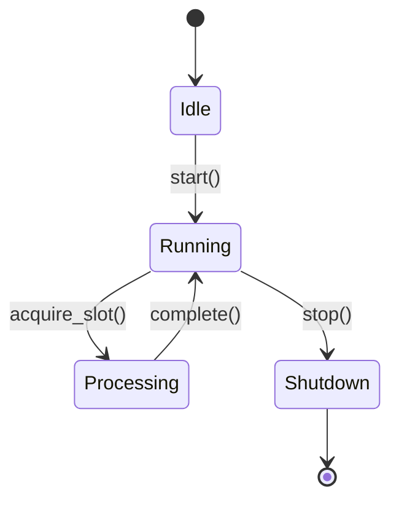

# Python Guidelines

Single source of truth for Python code in the agent-platform codebase. Use as a checklist when reviewing or writing code.

## Maintaining This Document

- Add new learnings via PR to this file
- A PR not passing formatting, linting, and type-checking is not ready for review

---

## Table of Contents

1. [Core Principles](#1-core-principles)
2. [Architecture & Design Patterns](#2-architecture--design-patterns)
3. [Type Safety & Data Integrity](#3-type-safety--data-integrity)
4. [Concurrency & Robustness](#4-concurrency--robustness)
5. [Error Handling & Integrity](#5-error-handling--integrity)
6. [Performance & Database Interaction](#6-performance--database-interaction)
7. [Testing & Quality Assurance](#7-testing--quality-assurance)
8. [Operations & Observability](#8-operations--observability)
9. [Documentation & Code Hygiene](#9-documentation--code-hygiene)
10. [Pull Request Guidelines](#10-pull-request-guidelines)

---

## 1. Core Principles

These universal software engineering principles guide all technical decisions.

### 1.1 KISS (Keep It Simple, Stupid) & YAGNI (You Ain't Gonna Need It)

**Principle:** Complexity is a liability. Don't build features, abstractions, or "optionality" for hypothetical future use cases.

**Application:**

- **Kill Tech Debt:** If a subsystem is buggy or unused, delete it. Don't patch it.
- **No Premature Abstraction:** Don't build a generic "Rule Engine" if a simple `if` statement suffices.
- **PR Size:** Keep PRs < 1,000 lines. Big PRs hide complexity and exhaust reviewers.

**Example:**

```python
# ❌ BAD: Over-engineered for "future flexibility"
class AbstractRuleEngine(ABC):
    @abstractmethod
    def evaluate(self, context: RuleContext) -> RuleResult: ...

# ✅ GOOD: Simple and direct
def should_process_user(user: User) -> bool:
    return user.is_active and user.has_permission("process")
```

### 1.2 DRY (Don't Repeat Yourself)

**Principle:** Every piece of knowledge must have a single, unambiguous, authoritative representation.

**Application:**

- **Shared Logic:** Extract repeated logic into helper methods or shared services
- **Rule of Three:** Wait until code is duplicated three times before abstracting (to avoid wrong abstractions)

### 1.3 SOLID Principles

**Single Responsibility Principle (SRP):** A class should have one reason to change.

- Split "God classes" (like giant Managers) into composed services (`SlotManager`, `QuotasService`)

**Open/Closed Principle:** Open for extension, closed for modification.

- Use **Strategy Patterns** so new behaviors can be added without modifying core logic

---

## 2. Architecture & Design Patterns

We prefer standard Design Patterns (Gang of Four) over ad-hoc solutions.

### 2.1 Strategy Pattern over Optionality

**Concept:** Define a family of algorithms, encapsulate each one, and make them interchangeable.

**Rule:** **Strategy > Optionality**. Don't clutter core logic with `if config.backend == 'x': ...`

**Implementation:**

```python
# ✅ GOOD: Strategy Pattern
class SqlGenerationStrategy(ABC):
    @abstractmethod
    async def generate_sql(self, query_intent: str) -> str: ...

class LegacySqlStrategy(SqlGenerationStrategy):
    async def generate_sql(self, query_intent: str) -> str:
        # Implementation for legacy approach
        ...

class AgenticSqlStrategy(SqlGenerationStrategy):
    async def generate_sql(self, query_intent: str) -> str:
        # Implementation for agentic approach
        ...

# Usage
strategy: SqlGenerationStrategy = (
    AgenticSqlStrategy() if config.use_agentic else LegacySqlStrategy()
)
result = await strategy.generate_sql(intent)
```

```python
# ❌ BAD: Inline optionality cluttering logic
async def generate_sql(query_intent: str, use_agentic: bool) -> str:
    if use_agentic:
        # Agentic logic
        ...
    else:
        # Legacy logic
        ...
```

**Decision Making:** Pick one technical solution and commit to it. Don't support multiple backends/options just for flexibility. Simplicity reduces maintenance burden.

### 2.2 Composition over Inheritance

**Concept:** Achieve code reuse by assembling classes containing other objects, rather than inheriting from a base class.

**Rule:** Avoid deep inheritance hierarchies (> 2 levels).

**Implementation:**

```python
# ✅ GOOD: Composition
class SlotExecutor:
    def __init__(self):
        self.slot_manager = SlotManager()
        self.quotas_service = QuotasService()
        self.metrics = MetricsCollector()

    async def execute(self):
        slot = await self.slot_manager.acquire()
        self.quotas_service.check(slot)
        self.metrics.record(slot)
```

### 2.3 Rich Domain Model (Encapsulation)

**Concept:** Objects should combine data and behavior. Logic belongs on the data it manipulates.

**Rule:** Encapsulate details about interacting with a class _on that class_.

```python
# ❌ BAD: Anemic Domain Model
class User:
    name: str
    email: str

def process_user(user: User) -> None:
    # External function operating on User
    ...

# ✅ GOOD: Rich Domain Model
class User:
    name: str
    email: str

    def process(self) -> None:
        # Logic lives with the data
        ...
```

**Anti-Pattern:** Creating "Utils" classes or standalone functions that operate on the internals of another domain object.

---

## 3. Type Safety & Data Integrity

### 3.1 Explicit Typing

**Principle:** Use Python's type system to **enforce logic**, not just for hints.

**The "No TypedDict" Rule:** **Never** use `TypedDict` or raw dictionaries for internal domain logic. Use **Pydantic** `BaseModel` or `@dataclass`.

```python
# ❌ BAD: TypedDict for domain model
class UserDict(TypedDict):
    user_id: str
    email: str

# ✅ GOOD: Pydantic for domain model
class User(BaseModel):
    user_id: str
    email: EmailStr

    def is_admin(self) -> bool:
        return self.email.endswith("@company.com")
```

**Strict Signatures:** Use `ParamSpec` and `Generic[T]` to propagate types through infrastructure code. Avoid `Any`.

```python
# ✅ GOOD: Generics for type safety
from typing import Generic, TypeVar

T = TypeVar('T', bound=BaseModel)

class Cache(Generic[T]):
    def get(self, key: str) -> T | None:
        ...

    def set(self, key: str, value: T) -> None:
        ...

# Type safety propagates to caller
user_cache: Cache[User] = Cache()
user: User | None = user_cache.get("123")  # Knows it's User
```

### 3.2 Use Pydantic Field Constraints for API Validation

**Principle:** Codify validation rules in the type system rather than relying on documentation. This provides automatic validation, better error messages, and self-documenting code.

```python
# ❌ BAD: Documenting constraints without enforcement
limit: Annotated[
    int | None,
    "Maximum rows to return. Defaults to 1000. Use -1 for all. Max: 100,000."
] = None

# ✅ GOOD: Enforcing constraints with Pydantic Field
from pydantic import Field

limit: Annotated[
    int | None,
    Field(
        default=None,
        ge=-1,      # Greater than or equal to -1
        le=100000,  # Less than or equal to 100,000
        description="Maximum rows to return. Defaults to 1000. Use -1 for all. Max: 100,000."
    )
] = None
```

**Rule:** If something can be enforced by the type system or validation layer, do that instead of relying on documentation.

**Reference:** [Pydantic Field Constraints](https://docs.pydantic.dev/latest/concepts/fields/#field-constraints)

### 3.3 Transactional Integrity (ACID)

**Principle:** Operations must be atomic.

**Rule:** If a multi-step operation fails (e.g., `create_agent` → `import_sdm` → `save_to_db`), you **must** roll back previous steps.

**Pattern:**

```python
async def upsert_agent_from_package(package: AgentPackage) -> Agent:
    agent = None
    try:
        agent = await create_agent(package)
        await import_sdm(agent.agent_id, package.sdm_data)
        await storage.save_agent(agent)
        return agent
    except Exception as e:
        if agent:
            # Rollback: Clean up partially created agent
            await storage.delete_agent(agent.agent_id)
        logger.error("Failed to upsert agent", exc_info=True)
        raise
```

---

## 4. Concurrency & Robustness

### 4.1 Defensive Async

**Principle:** Async systems are non-deterministic; code must force order and tracking.

**Task Lifecycle:** **Never** fire-and-forget a task. Track every `asyncio.Task` in a set. Implement explicit cancellation and cleanup.

```python
class TaskManager:
    def __init__(self):
        self._tasks: set[asyncio.Task] = set()

    def create_task(self, coro):
        task = asyncio.create_task(coro)
        self._tasks.add(task)
        task.add_done_callback(self._tasks.discard)
        return task

    async def shutdown(self, timeout: float = 10.0):
        """Cancel all tasks and wait for cleanup."""
        for task in self._tasks:
            task.cancel()

        if self._tasks:
            await asyncio.wait(self._tasks, timeout=timeout)
```

**Error Boundaries:** Every async loop needs a `try/except` block. Crashes must be logged and handled (restart or exit), never silently ignored.

```python
async def worker_loop():
    while True:
        try:
            await process_work_item()
        except asyncio.CancelledError:
            logger.info("Worker cancelled, shutting down")
            break
        except Exception as e:
            logger.error("Worker crashed, restarting", exc_info=True)
            await asyncio.sleep(1)  # Backoff before restart
```

### 4.2 Determinism

**Principle:** Reduce global state and side effects.

**Rule:** Explicitly pass context (IDs, config) down the stack. Don't rely on "guessing" or "fuzzy matching" to reconstruct state.

```python
# ❌ BAD: Guessing which SDM was used
async def execute_query(query: str):
    # Try to figure out which SDM this query came from
    sdm = guess_sdm_from_query(query)  # ⚠️ Lossy!
    ...

# ✅ GOOD: Explicit context passing
async def execute_query(query: str, sdm_name: str):
    # We know exactly which SDM to use
    sdm = await get_sdm(sdm_name)
    ...
```

### 4.3 No "Masking" Errors

**Principle:** Fail Fast.

**Rule:** Never catch an exception and return `None` just to keep running. "You must stand behind your code. If it breaks, let it crash so we fix it."

```python
# ❌ BAD: Masking errors
def get_user(user_id: str) -> User | None:
    try:
        return database.fetch_user(user_id)
    except Exception:
        return None  # ⚠️ Hiding the problem!

# ✅ GOOD: Let errors propagate
def get_user(user_id: str) -> User:
    return database.fetch_user(user_id)  # Raises if fails
```

**Exception:** Only mask errors for non-critical UI/display helpers where a default value is genuinely acceptable.

---

## 5. Error Handling & Integrity

### 5.1 Specific Exceptions

Raise specific, meaningful errors rather than generic `Exception`.

```python
# ✅ GOOD: Specific exceptions
class SDMNotFoundError(PlatformHTTPError):
    """Raised when a semantic data model is not found."""
    pass

def get_sdm(name: str) -> SemanticDataModel:
    sdm = storage.find_sdm(name)
    if not sdm:
        raise SDMNotFoundError(f"SDM '{name}' not found")
    return sdm
```

### 5.2 Structured Logging

**Standard:** Use `structlog` with context arguments.

```python
# ✅ GOOD: Structured logging
logger.info(
    "Processing work item",
    user_id=user_id,
    work_item_id=work_item_id,
    status="started"
)

# ❌ BAD: Formatted strings
logger.info(f"User {user_id} processing work item {work_item_id} - started")
```

**Why:** Structured logs are queryable, parseable, and enable better observability.

---

## 6. Performance & Database Interaction

### 6.1 Data Locality (SQL > Python)

**Principle:** Move the computation to the data.

**Rule:** If you are filtering, sorting, or sampling data, **do it in the database**.

```python
# ❌ BAD: Fetch all rows and filter in Python
rows = await db.execute("SELECT * FROM users")
active_users = [r for r in rows if r.is_active]

# ✅ GOOD: Filter in database
rows = await db.execute("SELECT * FROM users WHERE is_active = true")
```

**Database Operations:** Use `DISTINCT`, `LIMIT`, `SAMPLE`, and `WHERE` clauses aggressively. Avoid fetching 10k rows to filter them in Python loops.

### 6.2 Efficiency

**Rule:** Avoid "Retry Loops" for data fetching ("Try to get 10, if 5, try again"). Write correct queries that retrieve the needed data in one round-trip.

```python
# ❌ BAD: Retry loop
samples = await db.execute("SELECT * FROM data SAMPLE 10")
while len(samples) < 10:
    more = await db.execute("SELECT * FROM data SAMPLE 5")
    samples.extend(more)

# ✅ GOOD: One correct query
samples = await db.execute("SELECT * FROM data LIMIT 10")
```

### 6.3 Memory Management

**Rule:** Never load unbounded data into memory. Always cap or paginate.

```python
# ❌ BAD: Load all rows
if num_samples == -1:
    return await load_all_rows()  # ⚠️ OOM risk!

# ✅ GOOD: Default reasonable limit
DEFAULT_LIMIT = 500
MAX_LIMIT = 10000

if num_samples == -1:
    num_samples = DEFAULT_LIMIT
elif num_samples > MAX_LIMIT:
    num_samples = MAX_LIMIT
    logger.warning(f"Capping limit to {MAX_LIMIT}")

return await load_rows(limit=num_samples)
```

---

## 7. Testing & Quality Assurance

### 7.1 The Testing Pyramid

- **Unit Tests:** Fast, isolated logic tests
- **Integration Tests (Preferred):** Test end-to-end behavior with real (or simulated) storage
- **Rule:** Mock only the external boundary (e.g., OpenAI API). Don't mock internal methods.

```python
# ✅ GOOD: Integration test with real storage
@pytest.fixture
async def storage():
    db = SQLiteStorage(":memory:")
    await db.initialize()
    return db

async def test_create_agent(storage):
    agent = await create_agent(storage, name="TestAgent")
    assert agent.name == "TestAgent"

    # Verify it's actually in storage
    retrieved = await storage.get_agent(agent.agent_id)
    assert retrieved == agent
```

### 7.2 Meaningful Tests

**Rule:** Every test must assert a **side effect** or a **return value**.

**Ban:** "Fake tests" that just instantiate a class to bump coverage numbers.

```python
# ❌ BAD: Fake test
def test_user_creation():
    user = User(name="Test", email="test@example.com")
    # No assertions! ⚠️

# ✅ GOOD: Meaningful test
def test_user_is_admin():
    admin = User(name="Admin", email="admin@company.com")
    regular = User(name="User", email="user@external.com")

    assert admin.is_admin() is True
    assert regular.is_admin() is False
```

**Use Explicit Assertions Instead of Type Casts**

**Principle:** Tests should validate behavior, not work around type checking. Explicit assertions catch bugs and provide better error messages.

```python
# ❌ BAD: Using type cast to silence type checker
result = await process_data(...)
return json.loads(typing.cast(bytes, result))

# ✅ GOOD: Explicit assertion validates runtime behavior
result = await process_data(...)
assert isinstance(result, bytes), "Expected process_data to return bytes"
return json.loads(result)
```

### 7.3 Scenario Testing

**Rule:** Explicitly test failure modes.

**Questions to ask:**

- "What if the DB drops?"
- "What if the task crashes?"
- "What if we get invalid input?"

```python
async def test_create_agent_rollback():
    """Test that agent creation rolls back on failure."""
    with pytest.raises(ImportError):
        # Simulate failure during import
        await upsert_agent_from_package(broken_package)

    # Verify agent was NOT created (rollback worked)
    assert await storage.get_agent("test-id") is None
```

### 7.4 Test Data Management

**Principle:** Large test data files bloat the repository and slow down clones. Generate test data programmatically when possible.

```python
# ❌ BAD: Checking in large test data files
csv_path = Path("test_data/population_metrics_150k.csv")  # 9.5 MB file
csv_bytes = csv_path.read_bytes()

# ✅ GOOD: Generate test data programmatically
def create_test_dataframe(num_rows=1000):
    return pd.DataFrame({
        "id": range(num_rows),
        "value": [i * 10 for i in range(num_rows)]
    })
```

**When you MUST use files:**

- Use small representative samples (< 1 MB)
- Consider Git LFS for truly large files
- Document why the file is necessary
- Prefer CSV/JSON over binary formats when possible

**Rule of thumb:** If a test file is > 1 MB, ask "Can we generate this instead?"

### 7.5 Test Conciseness

**Prefer:** A few high-quality, curated tests over massive blocks of AI-generated boilerplate.

**Avoid:** 10-15 "do everything" tests that are hard to understand and maintain.

---

## 8. Operations & Observability

### 8.1 Structured Logging Standards

**Format:**

```python
logger.info(
    "event_name",
    user_id=uid,
    file_id=fid,
    duration_ms=elapsed
)
```

**Log Levels:**

- `DEBUG`: Detailed diagnostic information
- `INFO`: Normal operations, state changes
- `WARNING`: Unexpected but recoverable conditions
- `ERROR`: Errors that need attention
- `CRITICAL`: System-level failures

### 8.2 Metrics & Telemetry

Track key performance indicators:

- Request latency
- Error rates
- Resource usage (memory, CPU)
- Business metrics (queries processed, files uploaded)

### 8.3 Error IDs

Every error should have a unique ID for tracing:

```python
error_response = ErrorResponse(
    error_code="sdm_not_found",
    message=f"SDM '{name}' not found"
)
logger.error(
    "SDM not found",
    error_id=error_response.error_id,
    sdm_name=name
)
```

---

## 9. Documentation & Code Hygiene

### 9.1 Docstrings

**Standard:** Google-style docstrings for all public methods.

```python
def create_agent(name: str, config: AgentConfig) -> Agent:
    """Create a new agent with the given configuration.

    Args:
        name: The name of the agent
        config: Agent configuration including model and tools

    Returns:
        The newly created Agent instance

    Raises:
        ValueError: If name is empty or config is invalid
    """
    ...
```

### 9.2 Complex Logic Documentation

For complex state machines or lifecycles, include **Mermaid diagrams** in markdown docs.

````markdown
## SlotExecutor Lifecycle


````

### 9.3 Import Organization

```python
# Standard library
import json
import logging
import logging
from typing import Any

# Third-party
from fastapi import Request
from pydantic import BaseModel

# Local application
from agent_platform.core.user import User
from agent_platform.server.storage import BaseStorage
````

**Circular Dependencies:** Use `if typing.TYPE_CHECKING:` for type-only imports.

```python
from typing import TYPE_CHECKING

if TYPE_CHECKING:
    from agent_platform.server.storage.base import BaseStorage

def process_data(storage: "BaseStorage") -> None:
    ...
```

### 9.5 Kill Technical Debt

**Rule:** If a subsystem is buggy or unused, delete it. Don't patch it endlessly.

**Example:** Instead of spending weeks debugging a complex logical→physical translation layer, delete the layer and use direct queries.

---

## 10. Pull Request Guidelines

### 10.1 PR Size

**Rule:** Keep PRs < 1,000 lines.

**If larger:** Break into stacked PRs:

1. Models & types
2. Core logic
3. API endpoints
4. UI changes

**Goal:** "One pull request that can be reviewed & merged in a day."

### 10.2 PR Description

Include:

- **What:** Summary of changes
- **Why:** Problem being solved
- **How:** Approach taken
- **Testing:** How to verify
- **References:** Related tickets/PRs

### 10.3 Self-Review Checklist

Before submitting, verify:

- [ ] All tests passing
- [ ] Linting/formatting applied
- [ ] No commented-out code
- [ ] Meaningful test coverage
- [ ] Documentation updated
- [ ] No `Any` types (unless justified)
- [ ] Error handling implemented
- [ ] Logging added for key operations
- [ ] No magic numbers (use constants)

### 10.4 Review Response

When receiving feedback:

- **Accept:** Learn from architectural guidance
- **Discuss:** If you disagree, explain your reasoning
- **Iterate:** Make changes quickly to keep momentum

**Remember:** Reviews are about code quality, not personal criticism.

---

## 11. Security

### 11.1 Secrets Management

**Rule:** Secrets never live in code, logs, or version control.

```python
# ❌ BAD: Hardcoded secret
OPENAI_API_KEY = "sk-abc123..."

# ✅ GOOD: From environment
OPENAI_API_KEY = os.environ["OPENAI_API_KEY"]
```

**Pre-commit:** Use `detect-secrets` to catch accidental commits.

### 11.2 Input Validation

**Rule:** Validate at the API boundary with Pydantic. Trust internal data.

**Rule:** Always use parameterized queries.

```python
# ❌ BAD: SQL injection risk
query = f"SELECT * FROM users WHERE email = '{email}'"

# ✅ GOOD: Parameterized
query = "SELECT * FROM users WHERE email = :email"
result = await db.execute(query, {"email": email})
```

### 11.3 Authorization

**Rule:** Authenticate at the edge, authorize per-resource, fail closed.

```python
# ✅ GOOD: Check ownership on every access
@app.get("/agents/{agent_id}")
async def get_agent(agent_id: str, user: User = Depends(get_current_user)) -> Agent:
    agent = await storage.get_agent(agent_id)
    if agent.owner_id != user.id:
        raise HTTPException(status_code=403)
    return agent
```

### 11.4 PII in Logs

**Rule:** Redact sensitive fields before logging.

```python
# ✅ GOOD: Sanitize before logging
SENSITIVE = {"password", "token", "api_key", "email"}

def sanitize(data: dict) -> dict:
    return {k: "[REDACTED]" if k in SENSITIVE else v for k, v in data.items()}
```

---

## 12. API Design

### 12.1 REST Conventions

- Nouns, not verbs: `/agents`, not `/getAgents`
- Plural nouns: `/agents`, not `/agent`
- Nest for relationships: `/agents/{id}/runs`

### 12.2 Standard Response Envelope

```python
class PaginatedResponse(BaseModel, Generic[T]):
    data: list[T]
    meta: PaginationMeta

class PaginationMeta(BaseModel):
    total: int
    page: int
    page_size: int
```

### 12.3 Error Format

```python
class ErrorResponse(BaseModel):
    error_code: str      # Machine-readable: "agent_not_found"
    message: str         # Human-readable: "Agent 'abc123' not found"
    error_id: str = Field(default_factory=lambda: str(uuid4()))
```

### 12.4 Pagination

**Rule:** All list endpoints must paginate. Never return unbounded results.

```python
@app.get("/agents")
async def list_agents(
    page: int = Query(default=1, ge=1),
    page_size: int = Query(default=20, ge=1, le=100),
) -> PaginatedResponse[Agent]: ...
```

---

## 13. Dependency Management

### 13.1 Version Pinning

**Rule:** Pin exact versions. Commit lockfiles (`uv.lock`, `poetry.lock`).

### 13.2 Security Auditing

**Rule:** Run `pip-audit` in CI.

### 13.3 Evaluating New Dependencies

**Before adding, ask:**

- Actively maintained? (Last commit, open issues)
- Can I implement this in < 50 lines without the dep?

```python
# ❌ QUESTIONABLE: Dep for trivial task
import humps  # Just for camelCase

# ✅ GOOD: 3-line utility
def to_camel(s: str) -> str:
    parts = s.split("_")
    return parts[0] + "".join(p.title() for p in parts[1:])
```

---

## 14. Concurrency Additions

_Merge into existing Section 4._

### Connection Pooling

**Rule:** Use connection pools for DB and HTTP. Never create connections per-request.

### Timeouts

**Rule:** Every external call must have an explicit timeout.

```python
# ❌ BAD: No timeout
response = await client.get(url)

# ✅ GOOD: Explicit timeout
response = await client.get(url, timeout=10.0)
```

| Operation     | Timeout |
| ------------- | ------- |
| DB query      | 30s     |
| External API  | 10-30s  |
| LLM inference | 120s    |

---

## Summary: The 13 Commandments

1. **Keep it simple** - KISS & YAGNI
2. **Type everything explicitly** - No `TypedDict` for domain logic
3. **Encapsulate logic** - Methods belong on objects
4. **Use Strategy over Optionality** - Pick one path
5. **Fail fast** - Don't mask errors
6. **Be deterministic** - Pass context explicitly
7. **Push work to SQL** - Database > Python loops
8. **Test behavior** - Not just coverage
9. **PR size < 1K lines** - Break large changes
10. **Delete tech debt** - Don't patch forever
11. **Secure by default** — Parameterize queries, never log secrets
12. **Paginate everything** — No unbounded list endpoints
13. **Pin dependencies** — Lockfiles committed, audit in CI
