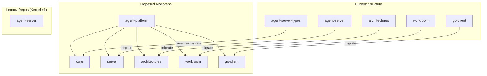

# Monorepo Proposal: Agent Platform

## Background

Our team currently maintains several separate repositories for kernel v1 development including agent-server-types, agent-server, and other related components. As we transition to kernel v2, we have an opportunity to simplify our development workflow by consolidating relevant repositories into a single monorepo while preserving git history.

## Proposal

We propose creating a new monorepo called **`agent-platform`** that will house all kernel v2 components. The existing agent-server repository will remain as-is for kernel v1 development, but we will clearly communicate in its README that new development will focus on the agent-platform monorepo.

## Structure and Components

The proposed monorepo will include the following components:

```
agent-platform/
├── core/                  # Core types and interfaces (renamed from agent-server-types)
├── architectures/         # Architecture implementations
├── server/                # Server implementation
├── client-sdks/           # Client SDKs for different languages
│   ├── python/
│   ├── typescript/
│   └── go/
├── deployment/            # Deployment configurations and tooling
├── tasks/                 # Repo-wide invoke task collection
└── docs/                  # Documentation
```

## Migration Plan

1. **Create New Monorepo**: Initialize the agent-platform repository
2. **Experiment with Potential Strategies**: Build out the monorepo and experiment with structure and tooling
3. **Prepare Source Repositories**: Move files in each source repository to their designated subdirectories
4. **Merge with History Preservation**: Merge each repository while preserving commit history
5. **Post-Migration Tasks**: Update READMEs, dependencies, project invoke tasks, and CI/CD pipelines

### Technical Approach for History Preservation

```bash
# Create new monorepo
mkdir agent-platform
cd agent-platform
git init

# For each source repository (example for agent-server-types)
git remote add -f agent-server-types [repo-url]
git merge agent-server-types/development-kernel --allow-unrelated-histories
```

## Benefits

- **Unified Development**: All kernel v2 components in one place
- **Simplified Dependency Management**: Direct references between components
- **Atomic Commits**: Ability to make coordinated changes across components
- **Easier Code Reuse**: Shared libraries directly available
- **Improved Collaboration**: Teams can contribute to multiple components

## Timeline

- **Week 1**: Experiment with potential strategies for history preservation, migration, and tooling
- **Week 2**: Create monorepo, merge agent-server-types (renamed to agent-server-core)
- **Week 2**: Merge remaining repositories, update documentation
- **Week 2**: Update CI/CD pipelines, ensure all tests pass
- **Week 2**: Begin new feature development in the monorepo structure

## Visualization



## Conclusion

The proposed agent-platform monorepo will provide a more cohesive development experience for kernel v2 while maintaining backward compatibility with kernel v1 through the existing agent-server repository. This approach allows us to leverage the benefits of a monorepo architecture for our future development while preserving the history and stability of our current systems.
