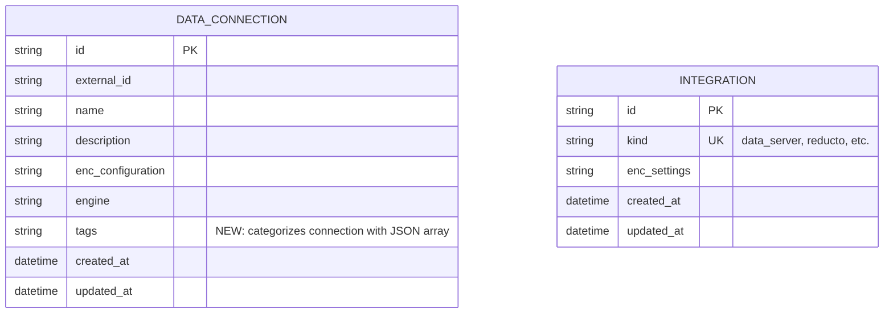
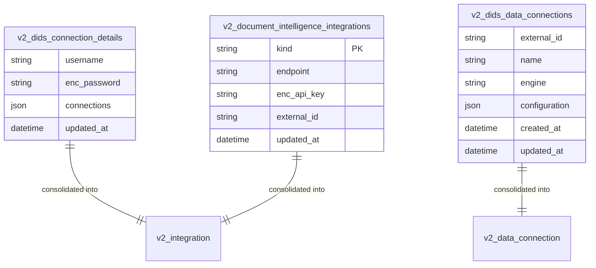
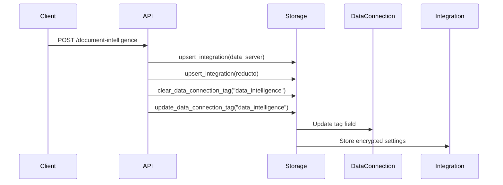

## Core Entities

### 1. Data Connection (`v2_data_connection`)

Stores configuration for various database connections that agents can use to access data.

**Schema**:

```sql
CREATE TABLE v2_data_connection (
    id TEXT PRIMARY KEY,
    external_id TEXT,
    name TEXT NOT NULL,
    description TEXT NOT NULL,
    enc_configuration TEXT NOT NULL,
    engine TEXT NOT NULL,
    tags TEXT DEFAULT '[]' CHECK (json_valid(tags)),
    created_at TEXT NOT NULL,
    updated_at TEXT NOT NULL
);
```

The `tags` field categorizes connections by purpose using a JSON array of strings (e.g., ["data_intelligence"])

### 2. Integration (`v2_integration`)

Unified table for storing different types of integration configurations.

**Schema**:

```sql
CREATE TABLE v2_integration (
    id TEXT PRIMARY KEY,
    kind TEXT NOT NULL UNIQUE,
    enc_settings TEXT NOT NULL,
    created_at TEXT NOT NULL,
    updated_at TEXT NOT NULL
);
```

**Integration Types**:

- **`data_server`**: Configuration for data server connections
- **`reducto`**: Configuration for Reducto

## Entity Relationships

### Core Entities

The unified system consists of two main entities that work together to provide flexible data connection and integration management:



### Conceptual Relationships

While there are no direct foreign key relationships between these tables, they work together conceptually:

1. **Tag-Based Association**: Data connections are tagged with a JSON array of strings (e.g., ["data_intelligence"]) to indicate their purpose
2. **Integration Types**: The `kind` field in integrations determines the type of service (data_server, reducto, etc.)
3. **Workflow Coordination**: In Document Intelligence workflows, tagged data connections work with specific integration types

### Legacy System Replacement

The unified system consolidates these legacy tables into the new unified structure:



**Consolidation Mapping**:

- **`v2_dids_connection_details`** → **`v2_integration`** (kind="data_server")
  - Connection details (username, password, endpoints) stored in `enc_settings`
- **`v2_document_intelligence_integrations`** → **`v2_integration`** (kind="reducto")
  - Integration configs (endpoint, api_key, external_id) stored in `enc_settings`
- **`v2_dids_data_connections`** → **`v2_data_connection`** (with tag="data_intelligence")
  - Data connection configs moved to unified table with tagging system

## Data Flow and Usage Patterns

### 1. Document Intelligence Workflow



### 2. Tag-Based Connection Categorization

The `tag` field in `v2_data_connection` enables categorization:

- **`"data_intelligence"`**: Connections specifically used for document intelligence
- **`""` (empty)**: General-purpose data connections

### 3. Integration Settings Structure

#### Data Server Integration

```json
{
  "kind": "data_server",
  "settings": {
    "username": "user",
    "password": "encrypted_password",
    "endpoints": [
      {
        "host": "localhost",
        "port": 8080,
        "kind": "http"
      }
    ]
  }
}
```

#### Reducto Integration

```json
{
  "kind": "reducto",
  "settings": {
    "endpoint": "https://api.reducto.com",
    "api_key": "encrypted_api_key",
    "external_id": "optional_external_ref"
  }
}
```

## API Usage Examples

### Tagging a Data Connection for Document Intelligence

```python
await storage.update_data_connection_tag(
    connection_id,
    DataConnectionTag.DOCUMENT_INTELLIGENCE
)
```

### Creating a Data Server Integration

```python
integration = Integration(
    id=str(uuid4()),
    kind="data_server",
    settings=DataServerSettings(
        username="user",
        password="pass",
        endpoints=[DataServerEndpoint(host="localhost", port=8080, kind="http")]
    )
)
await storage.upsert_integration(integration)
```

### Querying Tagged Connections

```python
connections = await storage.get_data_connections_by_tag(
    DataConnectionTag.DOCUMENT_INTELLIGENCE
)
```
