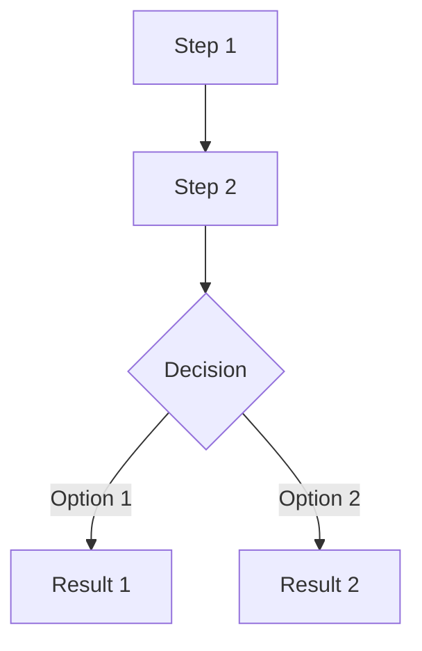

# Feature Specification: [Feature Name]

> **For AI Assistants:** Define WHAT to build. Each story needs: user story format (As a/I want/so that), Context (2-3 paragraphs explaining WHY), Scope (specific deliverables split into "What this produces" and "What this enables"), 5+ acceptance criteria, performance targets, edge cases, and dependencies.

**Status:** Proposed | In Progress | Approved | Implemented  
**Author:** [Team/Person]  
**Date:** YYYY-MM-DD  
**Implementation:** See [implementation-guide.md](./implementation-guide.md)

---

## Executive Summary

[2-3 sentences describing what this feature does and why it matters.]

**Key Capabilities:**

- **[Capability 1]:** [Description]
- **[Capability 2]:** [Description]
- **[Capability 3]:** [Description]

**Expected Impact:**

| Metric             | Target         |
| ------------------ | -------------- |
| [Primary metric]   | [Target value] |
| [Secondary metric] | [Target value] |

---

## Problem Statement

### 1. [Problem Area 1]

[Description of the problem, its impact, and why it needs to be solved.]

### 2. [Problem Area 2]

[Description of the problem, its impact, and why it needs to be solved.]

---

## Solution Overview

[1-2 sentences describing the high-level approach to solving the problem.]

### Example

[Provide a concrete example showing how the feature works. This could be YAML config, API request/response, or UI flow. Examples help both humans and AI understand the intended behavior.]

```yaml
# Example configuration or code
example_field: value
```

### What's New

| Concept             | Description         |
| ------------------- | ------------------- |
| **[New concept 1]** | [Brief description] |
| **[New concept 2]** | [Brief description] |

### What's NOT Included (by design)

> **Important:** Explicitly state what was intentionally excluded and why. This prevents scope creep and clarifies design decisions.

- **No [excluded feature 1]** - [Reason for exclusion]
- **No [excluded feature 2]** - [Reason for exclusion]

### Data Flow



---

## Requirements

### Functional

| ID   | Requirement               | Priority |
| ---- | ------------------------- | -------- |
| FR-1 | [Requirement description] | P0       |
| FR-2 | [Requirement description] | P1       |
| FR-3 | [Requirement description] | P2       |

### Non-Functional

| ID    | Requirement                       | Target   |
| ----- | --------------------------------- | -------- |
| NFR-1 | [Performance/latency requirement] | < Xms    |
| NFR-2 | [Throughput/capacity requirement] | [Target] |

### Expectations

| Name              | Expectation      |
| ----------------- | ---------------- |
| [Constraint name] | [Value or limit] |
| [Resource limit]  | [Value]          |

---

## Epics & Stories

### Epic A: [Epic Name]

**Goals:** [1-2 sentence description of what this epic achieves]

---

**Story A-1: [Story Name]**

> As a [persona], I want to [action] so that [benefit].

**Context:**

[2-3 PARAGRAPHS explaining:

- WHY this story matters and what problem it solves
- Background/current state that led to this need
- How this fits into the broader system or user workflow
- Any technical or business context needed to understand the approach

Include enough detail that both humans and AI understand the full picture and can make informed implementation decisions.]

**Scope:**

_What this story produces:_

- [Deliverable 1: e.g., "`Schema` TypedDict in `types.py` with fields: `name`, `description`, `config`"]
- [Deliverable 2: e.g., "YAML parsing that handles the new `schemas:` array"]
- [Deliverable 3: e.g., "Pydantic validation for definitions"]

_What this enables:_

- [Capability 1: what users can now do]
- [Capability 2: downstream feature this unlocks]
- [Capability 3: foundation for future stories]

**Acceptance Criteria:**

- [ ] [Testable criterion 1: must be verifiable]
- [ ] [Testable criterion 2]
- [ ] [Testable criterion 3]
- [ ] [Testable criterion 4]
- [ ] [Testable criterion 5]
- [ ] [Testable criterion 6: backward compatibility if applicable]

**Performance Target:** [e.g., "< 10ms added to load time"]

**Edge Cases:**

- [Case 1: e.g., "Empty array"]: [Specific behavior: "Treated as none defined"]
- [Case 2: e.g., "Duplicate names"]: [Specific behavior: "Rejected with validation error"]
- [Case 3: e.g., "Invalid syntax"]: [Specific behavior: "Parse error with line number"]

**Dependencies:** [Story ID or "None (builds on existing infrastructure)"]

---

**Story A-2: [Story Name]**

> As a [persona], I want to [action] so that [benefit].

**Context:**

[2-3 paragraphs as above]

**Scope:**

_What this story produces:_

- [Deliverable 1]
- [Deliverable 2]

_What this enables:_

- [Capability 1]
- [Capability 2]

**Acceptance Criteria:**

- [ ] [Criterion 1]
- [ ] [Criterion 2]
- [ ] [Criterion 3]
- [ ] [Criterion 4]
- [ ] [Criterion 5]

**Edge Cases:**

- [Case 1]: [Behavior]
- [Case 2]: [Behavior]

**Dependencies:** [Story A-1 (prerequisite story name)]

---

### Epic B: [Epic Name]

**Goals:** [1-2 sentence description]

---

**Story B-1: [Story Name]**

> As a [persona], I want to [action] so that [benefit].

**Context:**

[2-3 paragraphs]

**Scope:**

_What this story produces:_

- [Deliverable 1]
- [Deliverable 2]

_What this enables:_

- [Capability 1]
- [Capability 2]

**Acceptance Criteria:**

- [ ] [Criterion 1]
- [ ] [Criterion 2]
- [ ] [Criterion 3]
- [ ] [Criterion 4]

**Performance Target:** [e.g., "< 500ms for single operation"]

**Edge Cases:**

- [Case 1]: [Behavior]
- [Case 2]: [Behavior]

**Dependencies:** [Story A-1, External service API (existing)]

---

## Use Cases

### Use Case 1: [Use Case Name]

**Actor:** [Persona]  
**Goal:** [What they want to accomplish]

1. [Step 1: User action]
2. [Step 2: System response]
3. [Step 3: Outcome with example query like _"Show items over $500"_]

---

### Use Case 2: [Use Case Name]

**Actor:** [Persona]  
**Goal:** [What they want to accomplish]

1. [Step 1]
2. [Step 2]
3. [Step 3]
4. [Step 4: Final outcome]

---

## Success Metrics

| Metric                                    | Baseline                        | Target                                 |
| ----------------------------------------- | ------------------------------- | -------------------------------------- |
| [Metric 1: e.g., "Data queryable via NL"] | [Value: e.g., "0%"]             | [Value: e.g., "100% of defined items"] |
| [Metric 2: e.g., "Execution latency"]     | [Value: e.g., "N/A"]            | [Value: e.g., "< 500ms p95"]           |
| [Metric 3: e.g., "Integration time"]      | [Value: e.g., "Manual (hours)"] | [Value: e.g., "Declarative (minutes)"] |

---

## References

- [Implementation Guide](./implementation-guide.md) - Technical implementation details
- [Related Feature](./related-feature.md) - Related documentation
