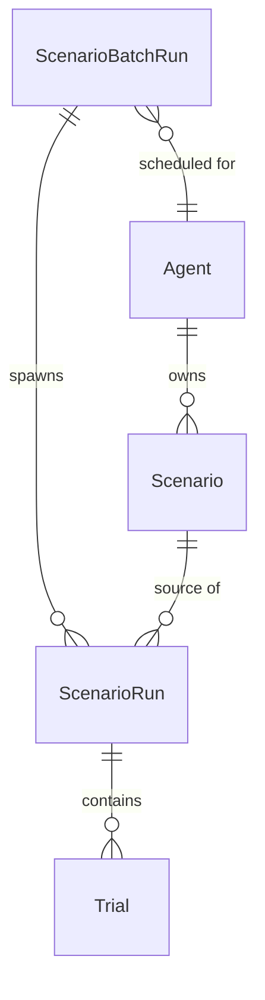
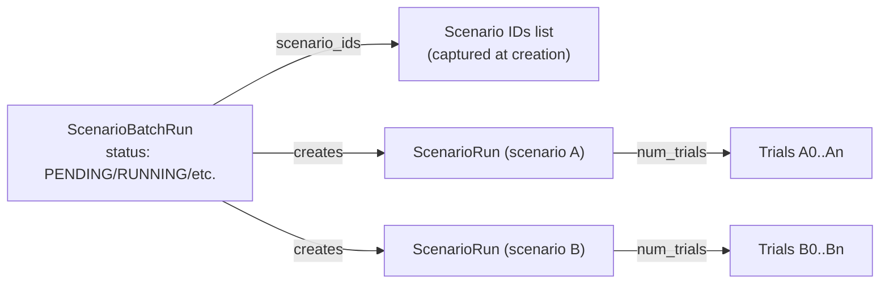

# Evaluations Data Model

This document illustrates how the evaluations pipeline stitches together batch runs, scenario runs, and individual trials.

## Entity Relationships

- Each `Scenario` belongs to exactly one agent, but an agent may define many scenarios.
- A `ScenarioBatchRun` is created per agent and captures a snapshot of the scenarios selected at scheduling time.
- Every `ScenarioRun` references the scenario it replays and may optionally reference the originating batch run.
- `Trial` rows are the atomic work units executed by the background worker; runs can request multiple trials to capture variability.

## Batch Composition Details

Notes:

- The batch stores the scenario identifier list so it can recalculate completion stats even if new scenarios are added later.
- Each scenario run produces `num_trials` rows immediately; the async worker dequeues them globally, so batches finish when all their trials reach a terminal status.
