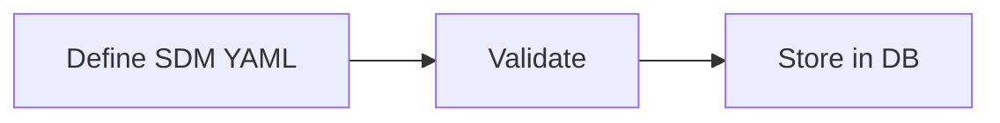
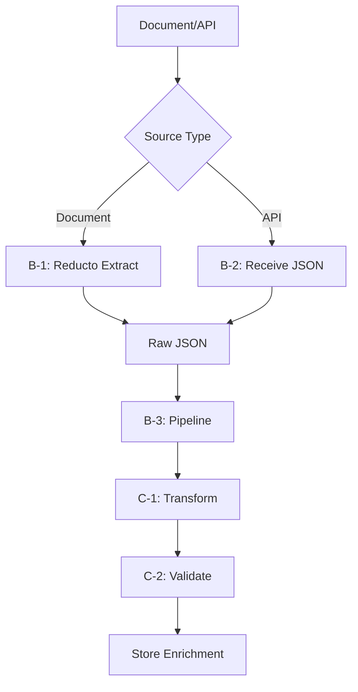
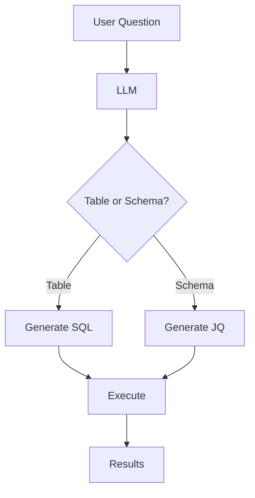

# SDM Hierarchical Data

> **For AI Assistants:** This is the complete feature specification. Use the [implementation guide](./sdm-hierarchical-data-implementation.md) for technical details.

**Status:** Proposed  
**Author:** Agent Platform Team  
**Date:** 2026-01-27

---

## Executive Summary

Extend SDM to support hierarchical JSON data structures (from Document Intelligence, API responses, JSON files) with semantic annotations, enabling natural language queries over JSON data.

**Key Capabilities:**

- **Schema definitions in SDM YAML:** Define JSON schemas with semantic annotations (synonyms, descriptions, sample values)
- **JQ transformations:** Declarative schema-to-schema transformations using JQ
- **JQ validations:** Business rules expressed as JQ predicates
- **Natural language queries:** LLM generates JQ queries for hierarchical data
- **LLM-inferred relationships:** LLM discovers schema relationships from semantic annotations

**Expected Impact:**

| Metric | Target |
| ------ | ------ |
| JSON data queryable via NL | 100% of defined schemas |
| DI extraction → SDM integration | Seamless (no manual translation) |
| JQ execution latency | < 500ms |

---

## Problem Statement

### 1. No Semantic Layer for JSON

SDM currently supports only tabular data (database tables, spreadsheets, data frames). JSON data from Document Intelligence extractions, API responses, and files cannot be queried via natural language.

### 2. Disconnected Document Intelligence

DI extracts structured JSON from documents but stores extraction schemas and translation rules outside SDM. DI outputs cannot be semantically described, queried, or transformed using the same tooling as tabular data.

### 3. No Declarative Transformations

Converting JSON between formats (e.g., vendor-specific invoice → canonical invoice) requires application code. There's no way to declare transformations in the data model.

---

## Solution Overview

Add schemas as first-class SDM elements, parallel to tables. At query time, the LLM generates JQ expressions (instead of SQL) to query schema data.

### Example SDM with Schemas

```yaml
name: Invoicing SDM

schemas:
  - name: generic_invoice
    description: 'Standard invoice format across all vendors'
    jsonschema: |
      {
        "$schema": "http://json-schema.org/draft-07/schema#",
        "type": "object",
        "required": ["invoice_number", "invoice_date", "line_items", "total"],
        "properties": {
          "invoice_number": {
            "type": "string",
            "description": "Unique invoice identifier",
            "synonyms": ["Invoice ID", "Invoice No", "Bill Number"],
            "semantic_type": "dimension",
            "sample_values": ["INV-12345", "2024-001"]
          },
          "total": {
            "type": "number",
            "description": "Total invoice amount",
            "synonyms": ["Grand Total", "Total Amount"],
            "semantic_type": "metric",
            "sample_values": [1234.56, 567.89]
          }
        }
      }

  - name: anahau_invoice
    description: 'Anahau vendor-specific invoice format'
    jsonschema: |
      {
        "type": "object",
        "properties": {
          "id": {
            "type": "string",
            "description": "Anahau invoice identifier",
            "synonyms": ["Invoice ID", "Anahau ID"],
            "semantic_type": "dimension",
            "sample_values": ["ANA-001", "ANA-002"]
          },
          "total_amount": {
            "type": "number",
            "description": "Total invoice amount",
            "synonyms": ["Total", "Amount Due"],
            "semantic_type": "metric",
            "sample_values": [150.00, 299.99]
          }
        }
      }
    transformations:
      - target: generic_invoice
        description: 'Convert Anahau format to generic invoice'
        jq: |
          { invoice_number: .id, total: .total_amount }
    validations:
      - name: total_positive
        description: 'Total must be positive'
        jq: '.total_amount > 0'
```

### What's New

| Concept | Description |
| ------- | ----------- |
| **`schemas` element** | Top-level array in SDM YAML, parallel to `tables` |
| **`jsonschema` attribute** | JSON Schema with semantic annotations (synonyms, semantic_type) |
| **`transformations`** | JQ rules to convert between schema formats |
| **`validations`** | JQ-based business rules |
| **JQ query generation** | LLM generates JQ (in addition to SQL) |

### What's NOT Included (by design)

- **No `sources`** - Data is associated at runtime via DI extraction or MCP
- **No `parent_schema`** - LLM infers relationships from semantic annotations
- **No `related_schemas`** - LLM infers relationships from semantic context

### Data Flow

**Design Time (SDM Definition):**


**Runtime (Data Acquisition - Epic B):**


**Runtime (Query - Epic D):**


---

## Requirements

### Functional

| ID | Requirement | Priority |
| -- | ----------- | -------- |
| FR-1 | Define schemas in SDM YAML with semantic annotations | P0 |
| FR-2 | Execute Reducto Extraction with SDM Schema | P1 |
| FR-3 | Query schemas via natural language (LLM generates JQ) | P1 |
| FR-4 | Execute JQ transformations between schemas | P2 |
| FR-5 | Execute JQ validations on schema data | P2 |

### Non-Functional

| ID | Requirement | Target |
| -- | ----------- | ------ |
| NFR-1 | JQ execution latency | < 500ms |
| NFR-2 | Schema parsing latency | < 10ms |

### Expectations

| Name | Expectation |
| ---- | ----------- |
| Max size of input JSON (xform) | 50MB |

---

## Epics & Stories

### Epic Overview

| Epic | Focus | Stories | Order |
| ---- | ----- | ------- | ----- |
| **A: Schema Definition** | Design time — defining schemas in SDM YAML | A-1, A-2 | 1st |
| **C: Transformations & Validations** | Processing logic — JQ transform and validate engines | C-1, C-2 | 2nd |
| **B: Data Acquisition** | Getting data in — extraction pipeline | B-1, B-2, B-3 | 3rd |
| **D: Natural Language Queries** | Getting data out — LLM prompts and JQ execution | D-1, D-2 | 4th |

### Epic Order: A → C → B → D

```
A (Define Schemas)
       ↓
C (Transform/Validate Engines)
       ↓
B (Extraction Pipeline - uses C)
       ↓
D (NL Queries)
```

**Why this order?** The extraction pipeline (Epic B) applies transformations and validations at extraction time, so Epic C must be implemented first.

---

### Epic A: Schema Definition

**Goals:** Enable schema definitions in SDM YAML with semantic annotations.

---

**Story A-1: Define Schemas in SDM YAML**

> As a data engineer, I want to define JSON schemas in SDM YAML so that hierarchical data has semantic metadata alongside tabular data.

**Context:**

Today, SDM only supports tabular data through the `tables:` array. When Document Intelligence extracts JSON from invoices, receipts, or contracts, that data lives outside the semantic layer. Data engineers must maintain separate metadata for JSON structures, and users cannot query this data using natural language.

By adding a `schemas:` array to SDM YAML, we bring JSON data into the same semantic framework as tables. Each schema includes a JSON Schema definition with embedded semantic annotations (synonyms, descriptions, sample values) that help the LLM understand the data structure. This enables a unified experience where users can query both tabular and hierarchical data.

The design follows the existing SDM pattern: schemas are first-class elements defined declaratively in YAML, validated at parse time, and stored in the database alongside tables and relationships.

**Scope:**

*What this story produces:*
- `Schema` TypedDict in `semantic_data_model_types.py` with fields: `name`, `description`, `jsonschema`, `transformations`, `validations`
- `schemas: list[Schema]` field added to `SemanticDataModel` Pydantic model
- YAML parsing that handles the new `schemas:` array
- Pydantic validation for schema definitions

*What this enables:*
- Data engineers can define JSON schemas in SDM YAML
- Schemas are stored in database alongside tables
- Schema represents the structure of the object (no validation)
- Foundation for DI integration, transformations, and NL queries
- Validations over the object can be expressed in natural language (implemented as JQ exprs)

**Acceptance Criteria:**

- [ ] `schemas` array parsed from SDM YAML without errors
- [ ] Required fields enforced: `name`, `jsonschema`
- [ ] Optional fields supported: `description`, `transformations`, `validations`
- [ ] Invalid schemas rejected with clear error messages
- [ ] Existing SDMs without schemas continue to work (backward compatible)
- [ ] Schema definitions stored in database via existing `set_semantic_data_model()`

**Performance Target:** Schema parsing adds < 10ms to SDM load time

**Edge Cases:**

- Empty `schemas:` array: Treated as no schemas defined
- Duplicate schema names: Rejected with validation error
- Invalid JSON Schema syntax: Rejected with parse error including line number

**Dependencies:** None (builds on existing SDM infrastructure)

---

**Story A-2: Semantic Annotations in JSON Schema**

> As a data engineer, I want to add semantic annotations (synonyms, descriptions, sample values) to JSON Schema properties so that the LLM can understand and query the data.

**Context:**

Standard JSON Schema defines structure (types, required fields) but lacks semantic metadata. When an LLM sees a field named `inv_no`, it may not understand this means "Invoice Number." Similarly, without sample values, the LLM cannot generate accurate filters or understand data patterns.

We extend JSON Schema by allowing semantic annotations directly in property definitions: `synonyms` (alternative names), `description` (what the field represents), `semantic_type` (dimension/measure/attribute), and `sample_values` (example data). These annotations are preserved during parsing and passed to the LLM prompt builder.

This approach keeps schema definitions self-contained—all metadata lives in the JSON Schema rather than scattered across separate files. It also mirrors how we annotate columns in table definitions.

**Scope:**

*What this story produces:*
- JSON Schema parser that preserves custom annotation fields
- Validation that annotations have correct types (arrays, strings)
- Example schema with full annotations in documentation

*What this enables:*
- LLM understands field semantics for accurate query generation
- Users can search by synonyms ("show me Invoice IDs" matches `inv_no`)
- Sample values help LLM generate valid filter expressions

**Acceptance Criteria:**

- [ ] `synonyms` array preserved in parsed schema
- [ ] `description` string preserved in parsed schema
- [ ] `semantic_type` enum (dimension/measure/attribute) preserved
- [ ] `sample_values` array preserved in parsed schema
- [ ] Annotations accessible in prompt builder via schema properties
- [ ] Missing annotations default to empty/null (not errors)

**Edge Cases:**

- Non-standard annotations (typos like `synonms`): Ignored, not rejected
- Very long descriptions (>1000 chars): Truncated in LLM prompts

**Dependencies:** Story A-1 (schema definition)

---

### Epic B: Data Acquisition

**Goals:** Execute DI extractions, receive API responses, and process through transform/validate pipeline.

**Dependencies:** Epic A (schemas defined), Epic C (transform/validate engines implemented)

---

**Story B-1: DI Extraction with Reducto**

> As a developer, I want to extract structured JSON from documents using Reducto with SDM schemas so that the raw extracted data can be processed by the pipeline.

**Context:**

When a user uploads a document (e.g., `CostcoReceipt.pdf`), this story extracts structured JSON using Reducto. This story focuses **only on the extraction step** — calling Reducto with the appropriate SDM schema and returning raw extracted data.

Schema selection is implicit — the LLM already has all SDM schemas in context (same pattern as tabular data) and selects the appropriate schema before calling extraction.

**Scope:**

*What this story produces:*
- `get_schema_jsonschema(schema_name, sdm_name)` — retrieve schema from SDM
- `parse_document(file_id)` — call Reducto parse
- `extract_with_schema(parsed_doc, jsonschema)` — call Reducto extract
- `di_extract(file_id, schema_name, sdm_name)` — convenience function

*What this story does NOT produce:*
- Schema selection (implicit — LLM has SDM context)
- Transformation (Story B-3)
- Validation (Story B-3)
- Enrichment storage (Story B-3)

**Acceptance Criteria:**

- [ ] `get_schema_jsonschema()` retrieves jsonschema from SDM
- [ ] `parse_document()` calls Reducto parse API
- [ ] `extract_with_schema()` calls Reducto extraction with jsonschema
- [ ] `di_extract()` combines parse + extract
- [ ] Returns raw data (no transformation applied)
- [ ] Error handling includes file and schema info

**Performance Target:** Depends on document size (pass-through to Reducto)

**Edge Cases:**

- Schema not found in SDM: Error with list of available schemas
- Document parse fails: Error with Reducto details
- Unsupported file type: Error before calling Reducto

**Dependencies:** Story A-1 (schema definition), DI service API (existing)

---

**Story B-2: MCP/API Response Handling**

> As a developer, I want to receive JSON data from MCP servers and external APIs so that the raw data can be processed by the pipeline.

**Context:**

MCP servers fetch JSON from external APIs (CRM, ERP, REST services). This story **receives and packages the data** — returning raw JSON for pipeline processing. Unlike B-1, which must call Reducto to extract JSON from documents, B-2 receives JSON directly from the API.

**Scope:**

*What this story produces:*
- Schema existence validation
- `receive_api_response(json_data, schema_name, sdm_name, source_metadata)` function
- `RawSchemaData` structure for pipeline input

*What this story does NOT produce:*
- Schema selection (implicit — LLM has SDM context)
- Transformation (Story B-3)
- Validation (Story B-3)
- Enrichment storage (Story B-3)
- MCP server implementation (existing infrastructure)

**Acceptance Criteria:**

- [ ] Validates schema exists in SDM
- [ ] `receive_api_response()` returns `RawSchemaData`
- [ ] Source metadata captured (endpoint, MCP server, timestamp)
- [ ] Output compatible with B-3 pipeline input
- [ ] Clear error when schema not found

**Performance Target:** < 10ms

**Edge Cases:**

- Schema not found: Error with list of available schemas
- API returns non-JSON: Error with content-type info
- Large JSON response (>10MB): Package with size warning

**Dependencies:** Story A-1 (schema definition), MCP infrastructure (existing)

---

**Story B-3: Extraction Pipeline Orchestration**

> As a developer, I want a unified pipeline that transforms, validates, and stores extracted data so that it's ready for natural language queries.

**Context:**

After B-1 (Reducto) or B-2 (API) returns raw JSON data, the pipeline must:
1. **Transform** the data from source schema to generic schema (if transformation defined)
2. **Validate** the data against validation rules
3. **Store** the data as a `SchemaEnrichment` in thread runtime metadata

This story orchestrates the full extraction-to-storage flow, using the transformation engine (C-1) and validation engine (C-2).

**Scope:**

*What this story produces:*
- `process_pipeline(thread_id, raw_data)` — main orchestration function
- Transformation integration (calls C-1)
- Validation integration (calls C-2)
- `SchemaEnrichment` dataclass
- Enrichment storage/retrieval APIs

*What this story does NOT produce:*
- DI extraction (Story B-1)
- API response handling (Story B-2)
- Transform engine (Story C-1)
- Validate engine (Story C-2)

**Data Flow:**

```
RawSchemaData from B-1/B-2
         ↓
1. Get schema definition (transformations, validations)
         ↓
2. Transform: source_schema → generic_schema (C-1)
   e.g., costco_receipt → generic_receipt
         ↓
3. Validate: run validation rules (C-2)
   Collect pass/fail results
         ↓
4. Store: SchemaEnrichment in thread metadata
         ↓
Ready for NL Queries (D-2)
```

**Key Principle: Design Time vs Runtime**

| Aspect | SDM (Design Time) | Enrichments (Runtime) |
|--------|------------------|----------------------|
| **What** | Schema definitions | Extracted data per file |
| **Volume** | 10s of schemas | 1000s of files |
| **Lifecycle** | Long-lived | Tied to thread |
| **Storage** | SDM YAML → JSONB | Thread metadata |

Enrichments reference SDM schemas by name. They are NOT stored in the SDM.

**Acceptance Criteria:**

- [ ] `process_pipeline()` orchestrates transform → validate → store
- [ ] Calls C-1 transformation engine
- [ ] Calls C-2 validation engine
- [ ] Respects validation modes: `warn` (continue) vs `reject` (error)
- [ ] `SchemaEnrichment` stored in thread metadata
- [ ] `get_enrichments()` retrieves by thread/source/schema
- [ ] Enrichments deleted when thread deleted
- [ ] Same source can have multiple enrichments (different schemas)

**Performance Target:** < 500ms (excluding transformation complexity)

**Edge Cases:**

- No transformation defined: Store raw data with source_schema = target_schema
- Transformation fails: Error with JQ details, no enrichment created
- Validation fails (warn mode): Store enrichment with failed validation results
- Validation fails (reject mode): Error, no enrichment created

**Dependencies:** Story B-1 (raw data), Story B-2 (raw data), Story C-1 (transform engine), Story C-2 (validate engine)

---

### Epic C: Transformations & Validations

**Goals:** Implement JQ transformation and validation engines that Epic B will use.

**Note:** Epic C is implemented BEFORE Epic B because the extraction pipeline (B-3) uses these engines.

---

**Story C-1: Execute JQ Transformations**

> As a data engineer, I want to define JQ transformations between schemas so that I can convert data formats declaratively.

**Context:**

Different systems use different JSON structures for the same concepts. A Costco receipt has different fields than an Amazon invoice, but both represent purchase data. Today, converting between formats requires application code that's hard to maintain and not visible in the data model.

JQ transformations let data engineers declare conversions in the schema definition. When a query needs data in a target schema format, the system automatically applies the transformation. This keeps conversion logic visible, testable, and versioned alongside the data model.

We reuse the existing `apply_jq_transform()` function from the orchestrator, which handles JQ execution safely with timeout and error handling.

**Scope:**

*What this story produces:*
- `SchemaTransformation` TypedDict with `target`, `description`, `jq` fields
- `execute_transformation()` function using existing `apply_jq_transform()`
- Transformation chaining (A → B → C)

*What this enables:*
- Declarative format conversions in SDM
- Automatic transformation during queries
- Visible, testable conversion logic

**Acceptance Criteria:**

- [ ] Transformations execute via `apply_jq_transform()`
- [ ] Target schema name validated against defined schemas
- [ ] Transformation errors include JQ expression and input sample
- [ ] Chained transformations execute in order
- [ ] Circular transformation chains detected and rejected

**Performance Target:** < 500ms for single transformation

**Edge Cases:**

- JQ syntax error: Clear error with expression and position
- JQ produces invalid JSON for target schema: Validation error
- Empty input: Return empty output (not error)

**Dependencies:** Story A-1 (schema definition), Existing `apply_jq_transform()` (no changes needed)

---

**Story C-2: Execute JQ Validations**

> As a data engineer, I want to define JQ validation rules so that I can enforce business rules on schema data.

**Context:**

Business rules like "invoice total must equal sum of line items" or "date must be in the past" are hard to enforce without application code. JQ validations let data engineers express these rules as JQ predicates that return true/false. Validations should strive to include context as to the reason for the failure.

Validations run at **extraction time** (in the B-3 pipeline) after transformations are applied. Failed validations can be configured to `warn` (log and continue) or `reject` (error, no enrichment stored). Validation results are stored with the enrichment and available in query responses.

**Scope:**

*What this story produces:*
- `SchemaValidation` TypedDict with `name`, `description`, `jq` fields
- `validate_schema_data()` function returning list of failures
- Validation mode: `warn` (log and continue) or `reject` (error)

*What this enables:*
- Declarative business rules in SDM
- Data quality visibility in query responses
- Consistent validation across all data sources

**Acceptance Criteria:**

- [ ] Validations execute as JQ predicates
- [ ] Failed validations return rule name and description
- [ ] `warn` mode logs failures but returns data
- [ ] `reject` mode returns error with all failures listed
- [ ] Validation timeout prevents infinite loops (default 5s)

**Performance Target:** < 100ms per validation rule

**Edge Cases:**

- JQ returns non-boolean: Treated as failure
- Multiple failures: All reported, not just first
- Validation on empty data: Skip validation, return success

**Dependencies:** Story A-1 (schema definition), Existing `apply_jq_transform()` (no changes needed)

---

### Epic D: Natural Language Queries

**Goals:** Include schema context in LLM prompts and generate JQ queries.

---

**Story D-1: Include Schemas in LLM Prompts**

> As a developer, I want schema context included in LLM prompts so that the LLM can generate queries for hierarchical data.

**Context:**

The prompt builder (`summarize_data_model()`) currently includes only table metadata. For the LLM to query schemas, it needs schema context: field names, descriptions, types, and semantic annotations.

We extend the prompt builder to include a "JSON Schemas" section listing each schema with its fields and annotations. This gives the LLM enough context to understand what data is available and how to query it.

**Scope:**

*What this story produces:*
- Extension to `summarize_data_model()` in `kernel/semantic_data_model.py`
- Schema summary format: name, description, field list with types
- Semantic annotations included in field descriptions

*What this enables:*
- LLM understands available schemas
- LLM can generate JQ queries for schema data
- Unified prompt with tables and schemas

**Acceptance Criteria:**

- [ ] Schemas appear in prompt under "## JSON Schemas" section
- [ ] Each schema lists name and description
- [ ] Schema fields listed with types and semantic annotations
- [ ] Prompt size increase < 500 tokens per schema
- [ ] Empty schemas array produces no schema section

**Performance Target:** < 10ms added to prompt generation

**Edge Cases:**

- Very large schema (100+ fields): Truncate to top 50 fields
- Deeply nested schema: Flatten to 2 levels in prompt
- No annotations: Use field name as description

**Dependencies:** Story A-1 (schema definition), Story A-2 (semantic annotations)

---

**Story D-2: Generate and Execute JQ Queries**

> As a user, I want to ask questions about JSON data in natural language so that I can query hierarchical data without writing JQ.

**Context:**

When the user provides JSON data without a known/matched schema, the Agent should implicitly be able to create a Schema from that object.

For all JSON objects with Schemas, the LLM can generate JQ queries to answer user questions. The execution path mirrors SQL: LLM generates JQ, system executes it against resolved schema data, results returned to user.

The LLM must decide whether a question targets tables (generate SQL) or schemas (generate JQ). This decision is based on entity mentions in the question matched against table/schema names and field names.

Users can see generated schemas, edit them, and save the schema in an SDM for future use.

**Scope:**

*What this story produces:*
- JQ query execution path in orchestrator
- LLM prompt instruction for JQ generation
- Entity matching to determine SQL vs JQ
- Implicit schema generation from JSON objects

*What this enables:*
- Natural language queries over JSON data
- Unified query experience for tables and schemas
- Complete hierarchical data support in SDM

**Acceptance Criteria:**

- [ ] LLM generates valid JQ for schema questions (unsaved in SDM)
- [ ] JQ queries execute against resolved schema data
- [ ] Results formatted consistently with SQL results
- [ ] Mixed questions (table + schema) generate appropriate query type
- [ ] Invalid JQ returns error with LLM retry
- [ ] Generated Schemas can be saved in an SDM

**Performance Target:** End-to-end query < 3s (including LLM)

**Edge Cases:**

- Ambiguous question (could be table or schema): Prefer table (existing behavior)
- JQ produces no results: Return empty with explanation
- JQ produces too many results (>1000): Truncate with warning

**Dependencies:** Story D-1 (schema context in prompts), Story B-3 (enrichments stored)

---

## Use Cases

### Use Case 1: Schema Definition

**Actor:** Data Engineer  
**Goal:** Define a schema for Costco receipts

1. Engineer creates SDM YAML with `costco_receipt` schema
2. System validates and stores SDM
3. Engineer can query: _"Show Costco receipts over $500"_

---

### Use Case 2: Schema Transformation

**Actor:** Data Engineer  
**Goal:** Transform vendor-specific invoice to generic format

1. DI extracts JSON matching `anahau_invoice` schema
2. User asks: _"Show all invoices over $1000"_
3. LLM applies transformation to `generic_invoice` format
4. Results include transformed Anahau data

---

### Use Case 3: Implicit Schema Generation

**Actor:** Business User  
**Goal:** Query JSON without pre-defining a schema

1. User uploads `purchase_order.json`
2. User asks: _"What's the total value?"_
3. LLM creates implicit schema and generates JQ query
4. User can save generated schema to SDM

---

## Success Metrics

| Metric | Baseline | Target |
| ------ | -------- | ------ |
| JSON data queryable via NL | 0% | 100% of defined schemas |
| JQ execution latency | N/A | < 500ms p95 |
| DI → SDM integration time | Manual (hours) | Declarative (minutes) |

---

## References

- [Implementation Guide](./sdm-hierarchical-data-implementation.md) - Technical implementation details
- [Schema Linking Specification](../schema-linking/schema-linking-specification.md) - Schema linking for tabular and hierarchical data
