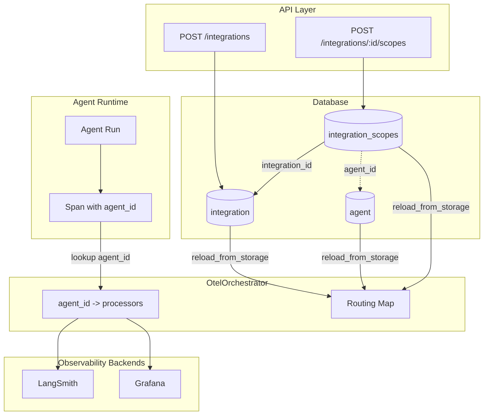

# OtelOrchestrator & Observability Integration Scopes

## Purpose

The OtelOrchestrator routes telemetry spans from agent runs to external observability backends (LangSmith, Grafana, etc.). It manages which backends receive data and which agents send to which backends.

## Architecture

## Data Model

Three tables work together:

| Table                | Purpose                                                                           |
| -------------------- | --------------------------------------------------------------------------------- |
| `integration`        | Stores observability backend configurations (provider, credentials, enabled flag) |
| `integration_scopes` | Junction table linking integrations to their scopes (global or per-agent)         |
| `agent`              | Stores agent definitions; referenced by agent-scoped integrations                 |

**Relationships:**

- `integration_scopes.integration_id` → `integration.id`
- `integration_scopes.agent_id` → `agent.agent_id` (only for agent-scoped entries)

## Concepts

### Observability Integration

An **Observability Integration** (subset of **Integration**) represents a connection to an observability backend. It contains:

- Provider type (`langsmith`, `grafana`)
- Connection credentials (URL, API key/token)
- Enabled/disabled flag

An integration by itself does nothing—it must be assigned a **scope** to start receiving spans.

### Scope

A **Scope** determines which agents can use an integration:

| Scope Type | Behavior                                              |
| ---------- | ----------------------------------------------------- |
| **Global** | All agents send spans to this integration             |
| **Agent**  | Only a specific agent sends spans to this integration |

Scoping is **additive**: globally-scoped observability integrations receive all spans from all agents, whereas agent-scoped integrations only receive spans from the agents they are scoped to.

## Workflow

### 1. Create an Observability Integration

Create a new observability backend connection via the API. At this point, no spans are routed yet.

### 2. Assign a Scope

Assign the integration to either:

- **Global scope** → All agents will send to this backend
- **Agent scope** → Only the specified agent will send to this backend

You can assign multiple scopes to the same integration (e.g., global + specific agents).

### 3. Spans are Routed Automatically

Once scoped, the orchestrator automatically routes spans based on the `agent_id` attribute:

- Looks up which integrations apply to that agent
- Sends the span to all applicable backends

## Example Configurations

**Single backend for everything:**

- Create LangSmith integration → Assign global scope
- Result: All agents send to LangSmith

**Different backends per agent:**

- Create LangSmith integration → Assign to Agent A
- Create Grafana integration → Assign to Agent B
- Result: Agent A → LangSmith, Agent B → Grafana

**Shared + dedicated:**

- Create Grafana integration → Assign global scope
- Create LangSmith integration → Assign to Agent A only
- Result: All agents → Grafana, Agent A → Grafana + LangSmith

## Lifecycle

### Enabling/Disabling an Observability Integration

| Action        | Effect                                                                                             |
| ------------- | -------------------------------------------------------------------------------------------------- |
| **Disable**   | Observability Integration is excluded from routing; no spans are sent to it. Scopes remain intact. |
| **Re-enable** | Observability Integration resumes routing based on its existing scopes.                            |

Disabling is useful for temporarily pausing telemetry to a backend without losing scope configuration.

### Deleting an Integration

- The integration row is removed from `integration`
- All associated scopes in `integration_scopes` are **cascade deleted**
- The orchestrator reloads and stops routing to that backend

### Deleting an Agent

- The agent row is removed from `agent`
- All agent-scoped entries for that agent in `integration_scopes` are **cascade deleted**
- Global scopes are unaffected
- The orchestrator reloads and removes the agent from its routing map

## Key Behaviors

- **No scope = no routing**: Observability Integrations without scopes don't receive any spans
- **Additive scoping**: Agents accumulate all applicable integrations (global + agent-specific)
- **Deduplication**: If multiple integrations point to the same backend with identical credentials, spans are sent only once
- **Hot reload**: Changes to integrations/scopes take effect immediately without server restart
