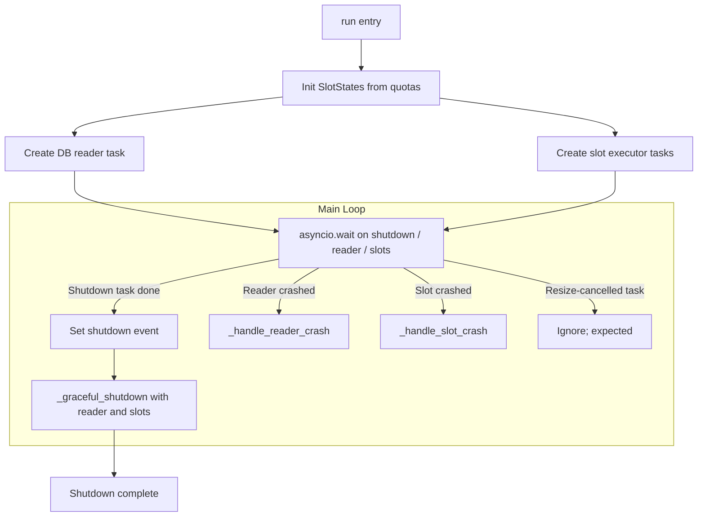
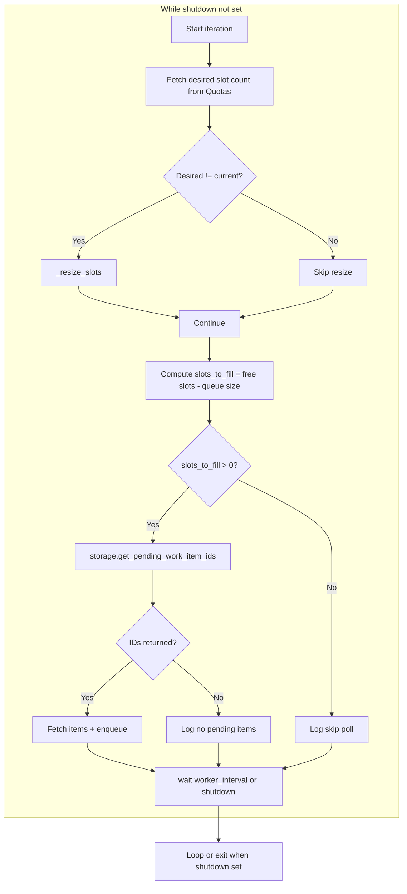
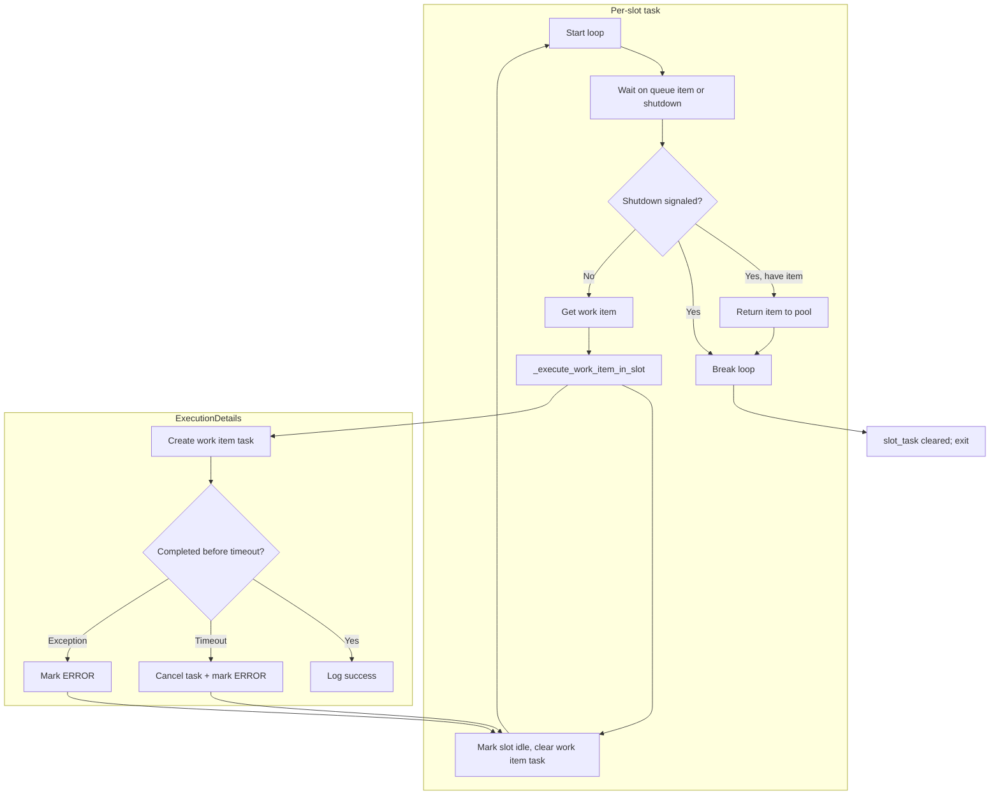

# SlotExecutor Lifecycle

### 1. Main `SlotExecutor.run` Loop

```mermaid
flowchart TD
    A[run entry]
    A --> B[Init SlotStates from quotas]
    B --> C[Create DB reader task]
    B --> D[Create slot executor tasks]
    C --> E
    D --> E
    subgraph Main Loop
        E[asyncio.wait on shutdown / reader / slots]
        E -->|Shutdown task done| F[Set shutdown event]
    F --> G[_graceful_shutdown with reader and slots]
    E -->|Reader crashed| H[_handle_reader_crash]
    E -->|Slot crashed| I[_handle_slot_crash]
        E -->|Resize-cancelled task| J[Ignore; expected]
    end
    G --> K[Shutdown complete]
```

### 2. Database Reader Task

```mermaid
flowchart TD
    subgraph ReaderLoop[While shutdown not set]
        L[Start iteration]
        L --> M[Fetch desired slot count from Quotas]
        M --> N{Desired != current?}
        N -->|Yes| O[_resize_slots]
        N -->|No| P[Skip resize]
        O --> Q[Continue]
        P --> Q
        Q --> R[Compute slots_to_fill = free slots - queue size]
        R --> S{slots_to_fill > 0?}
        S -->|Yes| T[storage.get_pending_work_item_ids]
        T --> U{IDs returned?}
        U -->|Yes| V[Fetch items + enqueue]
        U -->|No| W[Log no pending items]
        S -->|No| X[Log skip poll]
        V --> Y[wait worker_interval or shutdown]
        W --> Y
        X --> Y
    end
    Y --> Z[Loop or exit when shutdown set]
```

### 3. Single Slot Execution

```mermaid
flowchart TD
    subgraph SlotTaskLoop[Per-slot task]
        AA[Start loop]
        AA --> AB[Wait on queue item or shutdown]
        AB --> AC{Shutdown signaled?}
        AC -->|Yes, have item| AD[Return item to pool]
        AC -->|Yes| AE[Break loop]
        AC -->|No| AF[Get work item]
        AF --> AG[_execute_work_item_in_slot]
        AG --> AH[Mark slot idle, clear work item task]
        AH --> AA
    end
    subgraph ExecutionDetails
        AG --> AI[Create work item task]
        AI --> AJ{Completed before timeout?}
        AJ -->|Yes| AK[Log success]
        AJ -->|Timeout| AL[Cancel task + mark ERROR]
        AJ -->|Exception| AM[Mark ERROR]
        AL --> AH
        AM --> AH
    end
    AE --> AN[slot_task cleared; exit]
    AD --> AE
```
