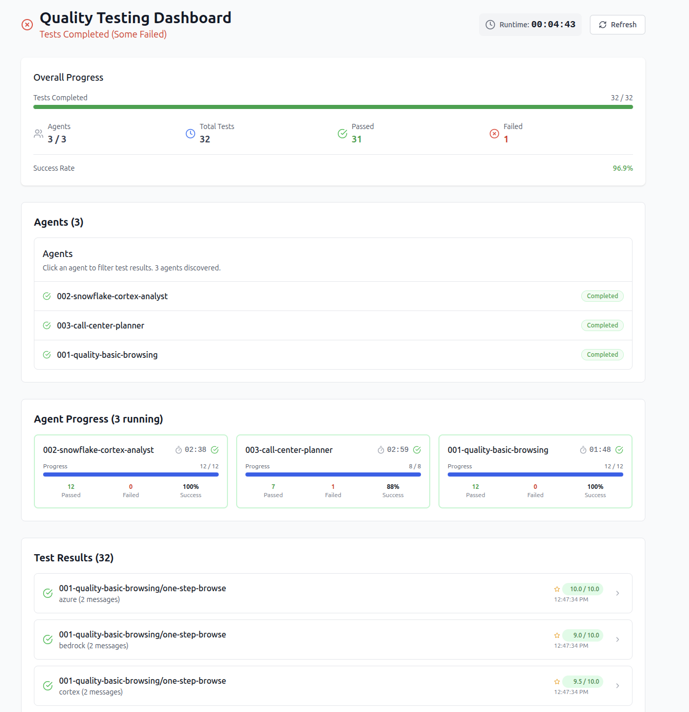

# Quality Testing Framework

A comprehensive testing framework for evaluating AI agent performance across multiple platforms and scenarios. This tool provides both a command-line interface and a web dashboard for running quality tests, analyzing results, and ensuring consistent agent behavior across different LLM providers.



## 🎯 Overview

The Quality Testing Framework enables you to:

- **Test agents across multiple platforms** (OpenAI, Azure, Bedrock, Cortex, Groq, Google)
- **Run automated evaluations** using LLM-based assessments, message counting, and tool call validation
- **Monitor test progress** through a real-time web dashboard
- **Generate comprehensive reports** with platform-specific analysis
- **Validate agent consistency** across different LLM providers

## 🚀 Quick Start

### Installation

From the root of the monorepo:

```bash
make sync
```

This installs the `quality-test` command globally.
Alternatively instead of `quality-test`, run `uv run python -m agent_platform.quality.cli` to the same effect.

### Basic Usage

1. **Start the agent server** (required for testing):

   ```bash
   make run-server
   ```

   Note: alternatively you can start it in debug mode in your favorite IDE in port 8000.

2. **Check server connectivity**:

   ```bash
   quality-test check-server
   ```

3. **Run all tests**:

   ```bash
   quality-test run
   ```

4. **Launch the web dashboard** (optional):
   ```bash
   cd quality/ui
   npm i
   npm run dev
   ```

## 📊 Web Dashboard

The web dashboard provides a real-time view of test execution with:

- **Live test progress** tracking across all agents
- **Platform-specific results** showing how agents perform on different LLM providers
- **Detailed evaluation reports** with pass/fail status and explanations
- **Agent performance metrics** and success rates
- **Interactive filtering** by agent or platform

Access the dashboard at `http://localhost:5173` when running the UI locally.

## 🏗️ Architecture

### Directory Structure

```
quality/
├── docs/                       # Documentation and images
│   └── quality-ui-example.png
├── src/                        # Python source code
│   └── agent_platform/
│       └── quality/
│           ├── cli.py          # Command-line interface
│           ├── runner.py       # Test execution engine
│           ├── orchestrator.py # Multi-platform orchestration
│           ├── evaluators.py   # Evaluation implementations
│           ├── reporter.py     # Result reporting
│           └── models.py       # Data models
├── test-agents/                # Agent packages (.zip files)
│   ├── 001-quality-basic-browsing.zip
│   ├── 002-snowflake-cortex-analyst.zip
│   └── 003-call-center-planner.zip
├── test-threads/               # Test definitions (two formats supported)
│   ├── 001-quality-basic-browsing/
│   │   ├── 001-simple-test.yml           # Direct YAML format
│   │   └── 002-complex-test/             # Directory format (with additional files)
│   │       ├── thread.yml                # Test definition
│   │       └── golden_results.csv        # Golden dataset for evaluation
│   ├── 002-snowflake-cortex-analyst/
│   └── 003-call-center-planner/
└── ui/                         # React web dashboard
    ├── src/
    ├── package.json
    └── ...
```

### Core Components

- **Runner**: Executes tests across multiple platforms concurrently
- **Orchestrator**: Manages agent deployment and thread execution
- **Evaluators**: Implements different evaluation strategies (LLM, counting, tool calls)
- **Reporter**: Generates reports in multiple formats (CLI, JSON, web)
- **Dashboard**: Real-time web interface for monitoring and analysis

## 📝 Test Definition Format

Tests support two organizational formats:

### Format 1: Direct YAML Files

Simple tests can be defined as YAML files directly in the agent directory:

```
test-threads/
└── my-agent/
    ├── 001-simple-test.yml
    └── 002-another-test.yml
```

### Format 2: Directory-Based Tests (with Additional Files)

For tests that need additional files (like golden datasets), create a directory containing `thread.yml`:

```
test-threads/
└── @preinstalled-sql-generation/
    └── 006-churn-dataframe-golden/
        ├── thread.yml                 # Test definition
        └── golden_churn_by_tier.csv   # Golden dataset
```

The test runner automatically discovers both formats.

### YAML Structure

Tests are defined in YAML files with a specific structure:

```yaml
thread:
  - name: example-test
    description: 'Test description'
    messages:
      - role: user
        content: |
          Your test message content here

target-platforms:
  - name: openai
    models: # Optional: specify models to test
      - openai/openai/gpt-5-medium
      - openai/openai/gpt-4o
  - name: azure
    models:
      - azure/openai/gpt-4o
  - name: bedrock # No models = uses platform default
  - name: groq

evaluations:
  - kind: llm-eval-of-last-agent-turn
    expected: |
      The agent should respond professionally and helpfully.
      The response should be accurate and well-formatted.
    description: 'Evaluate response quality'

  - kind: count-messages-in-last-agent-turn
    expected: 2
    description: 'Agent should send exactly 2 messages'

  - kind: tool-call-evaluation
    expected:
      calls: BrowseTool
      expected-args:
        url: 'https://example.com'
    description: 'Verify correct tool usage'
```

### Supported Platforms

| Platform  | Description           | Environment Variables                                              |
| --------- | --------------------- | ------------------------------------------------------------------ |
| `openai`  | OpenAI GPT models     | `OPENAI_API_KEY`                                                   |
| `azure`   | Azure OpenAI          | `AZURE_API_KEY`, `AZURE_ENDPOINT_URL`, `AZURE_DEPLOYMENT_NAME`     |
| `bedrock` | Amazon Bedrock        | `AWS_ACCESS_KEY_ID`, `AWS_SECRET_ACCESS_KEY`, `AWS_DEFAULT_REGION` |
| `cortex`  | Snowflake Cortex      | (Uses Snowflake auth)                                              |
| `groq`    | Groq (fast inference) | `GROQ_API_KEY`                                                     |
| `google`  | Google Gemini         | `GOOGLE_API_KEY`                                                   |

### Targeting Specific Models

By default, tests run with each platform's default model. You can specify multiple models to test per platform directly in the `target-platforms` section:

```yaml
target-platforms:
  - name: openai
    models: # Optional models list
      - openai/openai/gpt-5-medium
      - openai/openai/gpt-4o
  - name: azure
    models:
      - azure/openai/gpt-4o
  - name: bedrock # No models = uses platform default
```

**Model ID Format**: `platform/provider/model` (generic model ID)

**Execution Matrix**:

- With `models` specified: test runs once per model for that platform
- Without `models`: test runs once with platform default
- Total executions: `sum(models per platform) × trials`

**Strict Validation**: Model IDs must:

1. Exist in the platform catalog
2. Match the format `platform/provider/model`
3. Have platform prefix matching the platform name (e.g., models for `openai` must start with `openai/`)

If any targeted model is invalid or unavailable, the test will **fail fast** with a clear error message indicating which test case, platform, and model ID caused the failure.

### Evaluation Types

1. **`llm-eval-of-last-agent-turn`**: Uses GPT-4.1 to evaluate response quality against criteria
2. **`count-messages-in-last-agent-turn`**: Counts messages in the agent's response
3. **`tool-call-evaluation`**: Validates tool usage and parameters
4. **`sql-generation-result`**: Validates SQL generation subagent output.json file and it's schema. Specifically, it validates the status, has_sql, sql_contains, and sql_not_contains fields. It is not designed for complex SQL comparisons.
5. **`sql-golden-comparison`**: Compares generated SQL against expected "golden" SQL using an LLM. This is a more powerful evaluator that can compare SQL queries for semantic equivalence.
6. **`dataframe-golden-comparison`**: Compares agent-produced dataframes against a golden dataset with configurable tolerance and ordering

#### SQL Generation Evaluations

For tests targeting the SQL generation subagent, two specialized evaluators are available:

**`sql-generation-result`** - Validates the SQL subagent's output file (`output.json`):

```yaml
evaluations:
  - kind: sql-generation-result
    expected:
      status: success # "success" | "needs_info" | "failed"
      has_logical_sql: true
      has_physical_sql: true
      logical_sql_contains:
        - 'SELECT'
        - 'FROM wells'
      logical_sql_not_contains:
        - 'DROP TABLE'
      has_assumptions: false
```

**`sql-golden-comparison`** - Compares generated SQL against golden/expected SQL:

```yaml
evaluations:
  - kind: sql-golden-comparison
    expected:
      sql_type: logical # "logical" | "physical"
      comparison_mode: normalized # "exact" | "normalized" | "semantic"
      golden_sql: |
        SELECT well_name, operating_company, SUM(oil_production) as total_oil
        FROM wells
        GROUP BY well_name, operating_company
        ORDER BY total_oil DESC
        LIMIT 5
```

Comparison modes:

- **exact**: Direct string comparison (case-sensitive, whitespace-sensitive)
- **normalized**: Strips comments, collapses whitespace, lowercases before comparing
- **semantic**: Uses LLM to determine if queries are semantically equivalent

**`dataframe-golden-comparison`** - Compares agent-produced dataframes against golden dataset:

```yaml
evaluations:
  - kind: dataframe-golden-comparison
    expected:
      golden_file: golden_churn_by_tier.csv # File in test directory
      match_mode: ignore_order # "ignore_order" | "keyed"
      keys: ['customer_id'] # Required if match_mode is "keyed"
      relative_tolerance: 0.01 # 1% tolerance for numeric columns (default)
      columns_optional: false # Allow actual to have superset of columns
    description: >
      Validate that at least one dataframe produced by the agent matches the golden dataset.
```

**Match Modes:**

1. **`ignore_order`** (default): Treats dataframes as unordered sets of rows

   - Sorts both dataframes by ALL columns, then compares row-by-row
   - Use when: Row order doesn't matter and rows are unique by all their values
   - Example: Top 5 products by sales (no natural key, just unique combinations)

2. **`keyed`**: Matches rows by specific identifier columns
   - Sorts both dataframes by the specified key columns, then compares row-by-row
   - Use when: You have natural identifiers (customer_id, well_name, etc.)
   - Example: Customer records matched by customer_id, wells matched by well_name
   - **Important**: Key columns must uniquely identify rows for accurate matching

**Examples:**

_Ignore order mode (no natural key):_

```yaml
- kind: dataframe-golden-comparison
  expected:
    golden_file: golden_top_5_wells.csv
    match_mode: ignore_order # Sorts by all columns
```

_Keyed mode (match by identifier):_

```yaml
- kind: dataframe-golden-comparison
  expected:
    golden_file: golden_customer_metrics.csv
    match_mode: keyed
    keys: ['customer_id', 'month'] # Match rows by these columns
```

**Directory structure for dataframe tests:**

```
test-threads/
└── @preinstalled-sql-generation/
    └── 006-churn-dataframe-golden/
        ├── thread.yml              # Test definition
        └── golden_churn_by_tier.csv  # Golden dataset
```

Key features:

- **Pass-if-any-match**: Evaluates all dataframes produced in the thread; passes if any matches
- **Two matching strategies**: Use `ignore_order` for set-based comparison or `keyed` for identifier-based matching
- **Numeric tolerance**: Configurable relative tolerance (default 1%) for floating-point comparisons
- **Column flexibility**: Optionally allow actual dataframes to have extra columns beyond golden set
- **Multi-format support**: Loads golden files from CSV, TSV, Excel, JSON, or Parquet formats
- **Filesystem-based**: Golden datasets live alongside test definitions for easy version control

## 🔧 Command Reference

### Core Commands

```bash
# Check server status
quality-test check-server

# List available agents
quality-test list-agents

# List test cases (all or for specific agent)
quality-test list-tests [AGENT_NAME]

# Run tests
quality-test run --selected-agents=[AGENT_NAME]
```

### Advanced Options

```bash
# Run with detailed output
quality-test run --detailed

# Generate platform-focused summary
quality-test run --platform-summary

# Run only for a single platform (e.g., Groq)
quality-test run --platform groq

# Save results to JSON
quality-test run --output results.json

# Custom server URL
quality-test --server-url http://staging.example.com:8000 run

# Verbose logging
quality-test --verbose run

# Limit concurrent agents
quality-test run --max-agents 3

# Run specific tests (exact match or prefix match, comma-separated)
quality-test run --tests=bird-california-schools-001          # Exact match
quality-test run --tests=bird-california-schools              # All tests starting with prefix
quality-test run --tests=bird-                                # All BIRD tests
quality-test run --tests=churn-plan-tier-golden,energy-top-oil-producers-golden  # Multiple

# Filter by difficulty (BIRD benchmark tests)
quality-test run --tests=bird- --difficulty=simple            # Only simple BIRD tests
quality-test run --tests=bird- --difficulty=moderate          # Only moderate tests
quality-test run --tests=bird- --difficulty=challenging       # Only challenging tests
```

### BIRD Benchmark

Import BIRD benchmark tests with sensible defaults. One-time setup:

```bash
# 1. Install HuggingFace support
make sync # from repo root

# 2. Download minidev.zip from Google Drive and extract to default location
#    Link: https://drive.google.com/file/d/13VLWIwpw5E3d5DUkMvzw7hvHE67a4XkG/view
mkdir -p ~/.sema4x/quality/bird-data && cd ~/.sema4x/quality/bird-data
unzip ~/Downloads/minidev.zip

# 3. Start PostgreSQL stack (first time: ~5 min, subsequent: instant)
quality-test bird docker up
```

Creating new dataset tests:

```bash
# Import ALL databases at once
quality-test bird import \
  --db-path ~/.sema4x/quality/bird-data/minidev/MINIDEV/dev_databases

# Or import a single database
quality-test bird import \
  --db-path ~/.sema4x/quality/bird-data/minidev/MINIDEV/dev_databases/california_schools/california_schools.sqlite \
  --db-id california_schools
```

Before running tests, you need to create an SDM for the database. You can use our SPAR UI or Studio to generate an SDM. You should connect to the database you've brought up in the product and then reference the Excel files sitting alongside each database in MINIDEV for business context and then generate the SDM.

Save the new SDM in the `test-data/sdms/` directory similar to the existing data folder for california_schools, be sure to copy the config.yml file from california_schools as well.

```bash
# Run tests
quality-test run --tests=bird-california-schools

# Manage stack
quality-test bird docker ps      # Check status
quality-test bird docker down    # Stop (keeps data)
quality-test bird docker down -v # Remove completely
```

**Defaults** (override via env vars if needed):

- `BIRD_DEV_SQL_PATH`: `~/.sema4x/quality/bird-data/minidev/MINIDEV_postgresql/BIRD_dev.sql`
- `BIRD_PG_PORT`: `5433` (avoids conflicts with SPAR's 5432)
- HF dataset: `birdsql/bird_sql_dev_20251106`

For complete CLI reference, see `docs/BIRD_CLI_GUIDE.md`.

### Global Options

- `--server-url`: Override agent server URL (default: `http://localhost:8000`)
- `--test-threads-dir`: Directory containing test definitions (default: `quality/test-threads`)
- `--test-agents-dir`: Directory containing agent packages (default: `quality/test-agents`)
- `--platform`: Run tests only for the specified target platform (default: run all platforms in each test)
- `--verbose, -v`: Enable detailed logging

## 📊 Reporting

### CLI Reports

The framework provides several reporting formats:

```bash
# Standard report (organized by agent)
quality-test run

# Platform-focused summary
quality-test run --platform-summary

# Detailed report with full responses
quality-test run --detailed

# JSON output for programmatic analysis
quality-test run --output results.json
```

### Web Dashboard

The React-based dashboard offers:

- Real-time test execution monitoring (polls local files from `quality/.datadir`)
- Interactive result filtering and exploration
- Platform performance comparisons
- Detailed evaluation breakdowns
- Export capabilities

## 🔧 Configuration

### Environment Variables

Make sure you have your `.env` in the monorepo
root setup in accordance with our normal practices.

### Using OAuth in Tests

Example test `quality/test-agents/004-google-drive-oauth.zip`.

You need to setup a provider for the kind of oauth you want to test.

For example, for Google:

- Go to the Google Cloud Console.
- "Select a project" > "New project"
- APIs & Services → Library.
- Enable "Google Drive API"
- APIs & Services → OAuth consent screen.
- APIs & Services → Credentials.
  - Create Credentials → OAuth client ID.
  - Setup redirect URI to http://localhost:8080
  - Copy Client ID and Client Secrets

Then, edit `.datadir/config.yaml` in the quality tool.

```
agent_server_url: http://localhost:8000
agents_dir: quality/test-agents
threads_dir: quality/test-threads

oauth:
  google:
    client_id: <CLIENT_ID>
    client_secret: <CLIENT_SECRET>
    auth_url: https://accounts.google.com/o/oauth2/auth
    token_url: https://oauth2.googleapis.com/token
    redirect_uri: http://localhost:8080
```

Finally, run `quality-test oauth` to get access tokens.

Now, if you run tests, oauth actions will be authorized.

### Advanced Configuration

Tests support additional configuration options:

```yaml
# Snowflake authentication override
sf-auth-override:
  account: $SF_ACCOUNT
  role: $SF_ROLE
  private_key_path: $SF_PRIVATE_KEY_PATH
  private_key_passphrase: $SF_PRIVATE_KEY_PASSPHRASE
  user: $SF_USER

# Action secrets for agent tools
action-secrets:
  - name: web-actions
    actions:
      - name: browser-action
        secrets:
          - name: api_key
            value: $BROWSER_API_KEY
```

If you use `$VARIABLE` the harness will attempt to interpolate
that variable from the environment.

## 🎯 Best Practices

### Test Design

1. **Keep tests focused**: Each test should verify a specific behavior
2. **Use descriptive names**: Make test purposes clear from names and descriptions
3. **Test across platforms**: Include multiple platforms to ensure consistency
4. **Write clear evaluation criteria**: LLM evaluations work best with specific, measurable criteria

### Platform Testing

1. **Start with OpenAI**: Use as a baseline for comparison
2. **Test incrementally**: Add platforms one at a time to identify issues
3. **Monitor performance**: Different platforms may have varying response times
4. **Handle failures gracefully**: Some platforms may be temporarily unavailable

## 🔍 Troubleshooting

### Common Issues

**Server Connection Errors:**

```bash
# Check if server is running
quality-test check-server

# Verify server URL
quality-test --server-url http://localhost:8000 check-server
```

**Missing Platform Credentials:**

```bash
# Run with verbose logging to see missing variables
quality-test --verbose run
```

**Test Failures:**

```bash
# Run with detailed output to see agent responses
quality-test run --detailed

# Focus on specific agent
quality-test run specific-agent-name --detailed
```

### Debugging

We have a handy `Debug Quality CLI` target for use
with VSCode and Cursor.

## 🚀 Development

### Adding New Evaluators

1. Implement the evaluator in `src/agent_platform/quality/evaluators.py`
2. Add the evaluation kind to the `evaluate` method switch
3. Update test YAML files to use the new evaluator
4. Add documentation and examples
